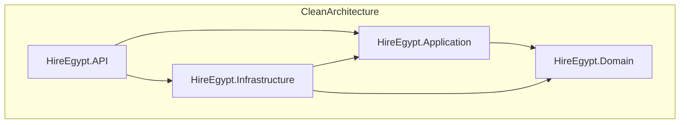
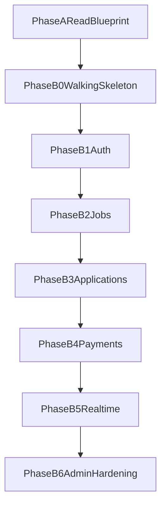

# HireEgypt Development Plan (vertical slices)

## Project summary

**Stack:** C# / ASP.NET Core (.NET 9), EF Core, SQL Server, Redis, MediatR (CQRS), FluentValidation Hangfire, SignalR, Paymob.

**Methodology:** Build **story-by-story**, adding only the domain model, persistence, handlers, and endpoints each story needs. Do **not** build the entire Domain layer up front.

**Before coding:** complete blueprint mastery docs in [docs/blueprint-mastery](../../docs/blueprint-mastery/README.md).

---

## Phase A — Blueprint understanding (no code)

Use [docs/blueprint-mastery/A0-product-scope.md](../../docs/blueprint-mastery/A0-product-scope.md) through [A3-api-workflows.md](../../docs/blueprint-mastery/A3-api-workflows.md). **Read the ERD** in the technical blueprint before data-heavy slices.

---

## Development phases (junior version)

Use this as your day-to-day guide. Each phase has a simple objective, clear start and finish, and interview prep.

## Per-story execution checklist (reuse for any project)

For every story, do these steps in order:

1. **Understand the story:** input, output, business rule, error cases.
2. **Domain (minimum only):** add or update only entities/enums/value objects needed now.
3. **Persistence:** EF config + migration only if schema changes.
4. **Application:** command/query + validator + handler.
5. **API:** endpoint + request/response contracts + Problem Details mapping.
6. **Tests:** at least one happy path and one edge/failure path.
7. **Docs:** update `DECISIONS.md` if you made a technical choice.

**Do not move to the next story** until this checklist is complete and tests are green.

---

## Phase B0 — Walking skeleton

**Why this phase exists:** prove the system can run end-to-end before real features.

**Start when:** Phase A docs are understood.

**Build:**

- Docker services for SQL Server and Redis ([docker-compose.yml](../../docker-compose.yml)).
- Register `AppDbContext` and add a DB health check endpoint.
- Enable Swagger UI.
- Add one integration test that hits API + DB.

**Finish gate:**

- `docker compose up -d` succeeds.
- API starts with no startup errors.
- `dotnet test` is green (including integration test).

**Interview prep:**

- Q: Why build a walking skeleton first?  
A: It reduces risk early by proving hosting, DB connectivity, and test setup before business complexity.
- Q: Why integration test this early?  
A: It validates wiring across layers and catches environment/config issues sooner.

---

## Phase B1 — Auth (one vertical slice per story)

**Why this phase exists:** auth is core for all later features and role-based behavior.

**Start when:** B0 gates are passed.

**Build order:**

1. **US-AUTH-01 company registration**
  - Domain: `User`, `Company`, `UserRole`, `BaseEntity` (minimal set only).
  - Infrastructure: EF config + migration for `Users` and `Companies`; verification token persistence.
  - Application: `RegisterCompanyCommand` + validator + handler (409 on duplicate email).
  - API: `POST /api/v1/auth/register/company`.
2. **US-AUTH-02 candidate registration**
  - Domain: add `Candidate` and required FK rules.
  - Infrastructure: migration if schema changed.
  - Application/API: command + validator + `POST /api/v1/auth/register/candidate`.
3. **US-AUTH-03 login/refresh/logout/verify-email**
  - Application: `LoginCommand`, `RefreshTokenCommand`, `LogoutCommand`, `VerifyEmailCommand`.
  - Infrastructure: JWT + hashed refresh token storage + password hashing service.
  - API: `POST /api/v1/auth/login`, `/refresh`, `/logout`, `/verify-email`.
  - Rule: company login requires `EmailVerified` and `IsApproved`.

**Finish gate:**

- Full auth flow works in Swagger.
- Automated tests cover happy + edge cases (duplicate email, invalid credentials, unverified user).

**Interview prep:**

- Q: Why store refresh tokens as hash?  
A: To protect tokens at rest; leaked DB data should not expose usable refresh tokens.
- Q: Why split commands (`Login`, `Refresh`, `Logout`) instead of one service method?  
A: Single-purpose handlers are easier to test, secure, and evolve in CQRS.

---

## Phase B2 — Jobs (vertical slices)

**Why this phase exists:** this is the first core business value after auth.

**Start when:** B1 auth flows and tests are stable.

**Build order:**

- **US-CO-01:** company creates draft, publishes listing, and lists own listings.
- **US-CA-01:** candidate searches/listings queries.
- **US-CO-06:** company closes listing with business rules.
- Add Redis caching only when query performance needs it in a real story.

**Finish gate:**

- Companies can publish/close jobs.
- Candidates can query listings.
- Permissions and state rules are tested.

**Interview prep:**

- Q: Why defer Redis until needed?  
A: Avoid premature complexity; optimize after confirming bottlenecks.
- Q: How do you enforce listing ownership?  
A: Authorization + query filters + domain/application checks.

---

## Phase B3 — Applications + notifications

**Why this phase exists:** completes hiring workflow between candidate and company.

**Start when:** B2 job lifecycle is complete.

**Build:**

- Add `JobApplication` flow stories: apply, review, status transitions.
- Implement only required handlers per story.
- Add `OutboxMessage` and Hangfire processor when email notifications are introduced.

**Finish gate:**

- Candidate can apply.
- Company can process applications through defined statuses.
- Notifications are reliable (outbox-backed) when enabled.

**Interview prep:**

- Q: Why outbox for notifications?  
A: It keeps DB state change and event publishing consistent, reducing lost-message risk.
- Q: Why status transitions in backend rules?  
A: Prevent invalid transitions and keep business invariants centralized.

---

## Phase B4 — Payments

**Why this phase exists:** monetization with external provider integration.

**Start when:** core hiring flow is stable.

**Build:**

- Implement `US-CO-04` with Paymob client.
- Add webhook endpoint and signature validation.
- Add `Payment` slice for status tracking and completion flow.

**Finish gate:**

- Payment initiation works.
- Webhook updates payment state safely and idempotently.

**Interview prep:**

- Q: What is the biggest webhook risk?  
A: Duplicate or forged callbacks; solve with signature checks and idempotency keys.

---

## Phase B5 — Real-time and background work

**Why this phase exists:** user experience and async processing improvements.

**Start when:** payments and core synchronous flows are stable.

**Build (as separate slices):**

- SignalR notifications,
- CV upload/blob storage,
- saved jobs,
- remaining Hangfire background jobs.

**Finish gate:**

- Real-time updates are scoped and authorized.
- Background jobs are retry-safe and observable.

**Interview prep:**

- Q: When to use SignalR vs polling?  
A: SignalR for low-latency updates; polling for simpler, low-frequency scenarios.

---

## Phase B6 — Admin and hardening

**Why this phase exists:** operational maturity, safety, and platform control.

**Start when:** user-facing MVP is functionally complete.

**Build:**

- Admin approvals and commands.
- Rate limiting, structured logging (Serilog), audit trails.
- Additional integration tests and Testcontainers where helpful.

**Finish gate:**

- Admin workflows control risky operations.
- Platform has protection, traceability, and production-focused observability.

**Interview prep:**

- Q: Why put hardening near the end and not first?  
A: Build core value first, then harden proven flows; still keep baseline security from day one.
- Q: How do you measure readiness for production?  
A: Reliability tests, observability coverage, failure handling, and operational runbooks.

---

## Story → phase map

| Priority | Stories                                                                            |
| -------- | ---------------------------------------------------------------------------------- |
| MVP high | US-AUTH-01..03, US-CO-01, US-CA-01, US-CO-06, US-CA-02..04, US-CA-06, US-CO-02..04 |
| MVP high | US-CO-04                                                                           |
| Medium   | US-CO-05, US-CA-03, US-CA-05                                                       |
| High/Med | US-AD-01..03                                                                       |

---

## Key files (living)

- [src/HireEgypt.API/Program.cs](../../src/HireEgypt.API/Program.cs)
- [src/HireEgypt.Infrastructure/Persistence/AppDbContext.cs](../../src/HireEgypt.Infrastructure/Persistence/AppDbContext.cs)
- [DECISIONS.md](../../DECISIONS.md)

