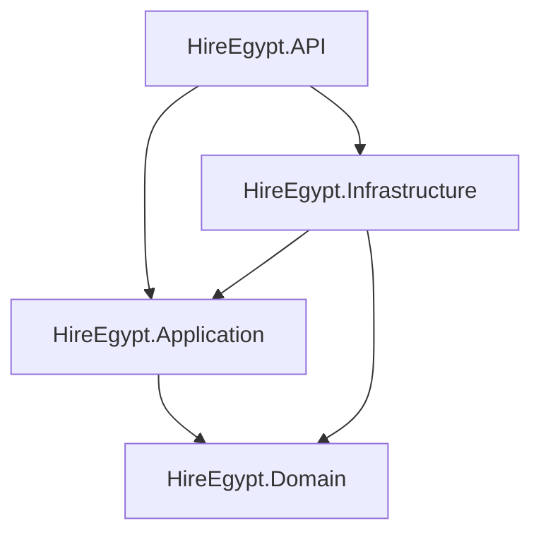

# Phase A1 — Architecture (artifact)

**Sources:** blueprint architecture section; [DECISIONS.md](../../DECISIONS.md); layer READMEs under `src/*/README.md`.

## Dependency rule (Clean Architecture)

- **Domain:** no references to other projects; no EF/JWT/HTTP types.
- **Application:** orchestrates use cases (commands/queries); depends only on Domain abstractions + its own DTOs/contracts.
- **Infrastructure:** EF Core, JWT implementation, email, Redis, Hangfire, Paymob — **implements** interfaces defined in Domain/Application.
- **API:** HTTP, DI composition, middleware; stays thin — delegates to MediatR.

## What belongs where (checklist)

| Concern | Layer |
|--------|--------|
| Entity invariants, enums, value objects | Domain |
| `SaveChanges`, DbContext, migrations | Infrastructure |
| “Register user” orchestration, validation rules for request | Application |
| JWT signing config, `AuthController` | API (+ Infrastructure for token service impl) |
| Repository interface `IUserRepository` | Domain (implemented in Infrastructure) |

## Cross-cutting decisions (from DECISIONS)

- **CQRS (MediatR):** one handler per use case; controllers don’t contain business rules.
- **Transactional outbox:** side effects (email, SignalR) eventually via outbox + Hangfire; auth emails can start as direct `IEmailSender` until outbox slice.
- **Hangfire:** background/outbox later; not required for first auth vertical slice.

## NFRs to watch (from blueprint / typical SaaS)

- **Security:** password storage (hashing), JWT expiry, refresh rotation, webhook HMAC (Paymob later).
- **Multi-tenancy:** tenant id on requests; resolver middleware at API edge.
- **Reliability:** idempotent webhooks, outbox for notifications.

## Artifact output

A “dependency map” is the diagram above; use the **checklist** when adding a file so it lands in the correct project.
